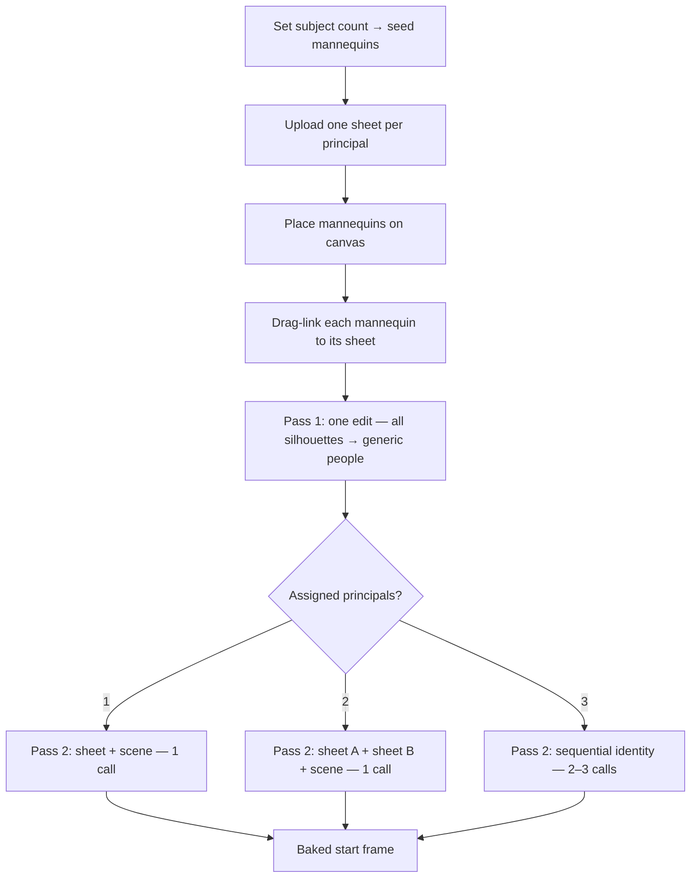

# Mannequins & Bake Start Frame

How the Lock Start Frame bake workflow works, what inpainting and FLUX Fill are, and why baking uses a two-pass design instead of replacing mannequins directly from the character sheet.

## Inpainting

**Inpainting** means editing an existing image by regenerating only part of it while leaving the rest alone. You provide:

- the **source image** (your scene)
- a **mask** (white = change this, black = keep this)
- a **prompt** (what to put in the masked region)

The model fills the masked areas so they blend with the surrounding pixels — lighting, perspective, edges, and so on.

In our bake flow, the mask is built from mannequin silhouettes on a black canvas. Only the mannequin regions get regenerated; the backdrop stays untouched.

## FLUX Fill

**FLUX Fill** (`black-forest-labs/flux-fill-pro` on Replicate) is a dedicated inpainting model. It was our original Pass 1 before xAI:

1. Client renders backdrop + mannequin **mask**
2. FLUX Fill inpaints the mask with a generic prompt like *"photorealistic person, seamless integration with backdrop lighting…"*
3. Result: gray mannequins become believable people, correctly placed in the scene

Because it uses a **pixel-accurate mask**, changes are confined to mannequin shapes. The backdrop is never touched.

xAI has no mask API, so we switched to **image edit**: composite the gray mannequins onto the backdrop and prompt the model to replace those silhouettes. Same goal, less precise spatial control.

## Why not skip Pass 1 and go straight from character sheet → composite?

The two-pass design separates **scene placement** from **character identity**. They solve different problems.

### 1. The character sheet doesn't encode scene placement

A character sheet is a reference image — turnaround, neutral pose, often plain background. It tells you *who* the character is, not *where they stand* in the shot.

The **mannequin** is the spatial authoring tool: position, scale, rotation, facing angle, opacity. That layout lives only in the composite, not in the character sheet.

### 2. Pass 1 establishes a believable person in the scene

Pass 1 asks: *"Put a photorealistic human here, matching this backdrop's lighting and shadows."*

That's already a hard task — pose fidelity, scale, ground contact, shadow direction, color temperature. Pass 1 produces a scene where a human **belongs** in that spot.

### 3. Pass 2 swaps identity onto an already-correct scene

The optional identity pass (when a character sheet exists) asks a narrower question: *"Keep this composition, but make the person look like `<IMAGE_0>`."*

The identity prompt instructs the model to take face, body, wardrobe, and proportions from the character sheet while keeping the scene environment from the baked frame. Pass 2 gets a **finished scene** as `<IMAGE_1>` (correct pose, lighting, integration) rather than a raw composite with gray blobs. Identity transfer works better when placement is already solved.

### 4. One-shot "sheet replaces mannequin" stacks too many jobs

A single edit from composite + character sheet would ask the model to simultaneously:

- find gray mannequin shapes
- read pose/scale from them
- extract face/body/wardrobe from the sheet
- ignore the sheet's background
- match backdrop lighting
- remove all gray artifacts

That's brittle. Splitting it into **integrate a person** → **apply identity** is more reliable and easier to debug.

### 5. Pass 1 still works without a character sheet

If no character sheet is uploaded, Pass 1 alone produces generic photorealistic figures in the right poses. The identity pass is optional enrichment, not a prerequisite for baking.

## Summary

Mannequins define *where and how*; Pass 1 turns that into a real person in the scene; Pass 2 (optional) makes that person *your* character. Skipping Pass 1 and jumping straight to the sheet conflates spatial composition with identity transfer, and both tend to suffer.

## Current flow (xAI)

1. **Client** — Render backdrop, composite (backdrop + gray mannequins), and mask (Replicate fallback only).
2. **Pass 1** — xAI image edit on the composite with `BAKE_XAI_EDIT_PROMPT` to replace silhouettes with photorealistic people.
3. **Pass 2 (optional)** — xAI multi-image edit with character sheet + Pass 1 output to apply subject identity.

Key files:

| File | Role |
|------|------|
| `lib/studio/bake-start-frame.ts` | Render composite/mask; bake prompts |
| `lib/studio/generation/adapters/inpaint.ts` | xAI image edit + Replicate FLUX Fill |
| `store/useStudioStore.ts` | `bakeStartFrame()` orchestration |
| `app/api/bake-start-frame/route.ts` | Server route for Pass 1 + optional Pass 2 |
| `lib/studio/generation-prompt.ts` | Identity pass reference prompts (`<IMAGE_N>`) |

## Multi-person casts (2+ people)

Pass 1 already supports multiple mannequins in **one** API call — every silhouette is composited together and replaced in a single xAI image edit. Spatial placement is implicit: left mannequin → left person, and so on. No character sheets are involved in Pass 1.

Pass 2 is where multi-person breaks down today. The identity prompt in `generation-prompt.ts` assumes a **single** Subject reference applied to the whole baked scene. With 2–3 mannequins, Pass 1 produces correctly placed generic people, but Pass 2 would try to make **everyone** look like the same character sheet.

### What xAI supports

Per the [image edits API](https://docs.x.ai/developers/rest-api-reference/inference/images):

- Up to **3 source images** per edit (`images` array; mutually exclusive with single `image`).
- Prompt must name each ref explicitly: `<IMAGE_0>`, `<IMAGE_1>`, `<IMAGE_2>` (0-based, in request order).
- Multi-image edit is intended for *"combining subjects, transferring styles, and composing scenes"* ([Imagine overview](https://docs.x.ai/developers/model-capabilities/imagine)).

xAI's [reference-to-video docs](https://docs.x.ai/developers/model-capabilities/video/reference-to-video) use the same pattern — different refs for different elements (*"the model from `<IMAGE_1>` … they wear the shirt from `<IMAGE_2>`"*). One ref, one job, assigned in text.

### Separate sheets vs. joined cast sheet

| Approach | Verdict |
|----------|---------|
| **One character sheet per principal** | Best. Maps cleanly to `<IMAGE_N>` tags; highest identity fidelity. |
| **Joined cast sheet** | Weak as a primary bake input. Small faces, ambiguous left/right mapping, trait mixing ("concept bleeding"). OK for the user's own cast overview, not for API binding. |

Industry consensus matches this: Midjourney errors on two `--cref` in one prompt; the standard workaround is **sequential** placement (add character A, then region-edit character B). Stable Diffusion workflows recommend generating characters separately and compositing, then a low-strength blend pass — same separation-of-concerns as our two-pass bake.

### Pass 2 strategy by cast size

| People | API calls (after Pass 1) | Images in each Pass 2 call |
|--------|--------------------------|----------------------------|
| **1** | 1 | `<IMAGE_0>` sheet + `<IMAGE_1>` baked scene |
| **2** | 1 | `<IMAGE_0>` char A + `<IMAGE_1>` char B + `<IMAGE_2>` baked scene |
| **3** | 2–3 (sequential) | 3 sheets + scene = 4 images — exceeds the 3-image cap |

For **3 principals**, run sequential identity passes: apply one character per call, using the latest frame as the scene ref each time. Alternatively batch 2 identities in the first call, then 1 in a second.

Example prompt for 2 people:

```
The leftmost standing figure — face, body, and wardrobe only — comes from <IMAGE_0>.
The rightmost standing figure — face, body, and wardrobe only — comes from <IMAGE_1>.
Ignore all backgrounds in <IMAGE_0> and <IMAGE_1>.
Scene composition, positions, scale, lighting, and backdrop come entirely from <IMAGE_2>.
Do not swap identities between the two figures.
```

Derive *leftmost / center / rightmost* by sorting mannequins on normalized `x`. Use explicit spatial language in the prompt — xAI and Grok multi-image guides both stress that position words (*"left foreground"*, *"right third of frame"*) reduce identity swaps.

### Dirty-single edge case

When `subjectCount` is `1s` with `dirty-single` coverage, two mannequins are seeded but only the **opaque** main figure should receive a character assignment. The faint shoulder mannequin (`opacity` ~0.3) stays generic.

### Implementation status

**Bake stack PR1–PR4:** shipped. See [`MANNEQUIN-PR-TRACKER.md`](MANNEQUIN-PR-TRACKER.md) for canonical PR status (both bake and composition stacks).

**Remaining (bake):** Phase 5 unit tests (Vitest not set up).

---

## Cast tiers & bake orchestration

Design decisions for how Lock Start Frame scales beyond a single principal.

### No per-character user workflow loop

The checklist stays **one linear path** for every cast size:

1. Character Sheet(s)
2. Backdrop
3. Place Mannequins
4. Assign Characters
5. Bake

Users click **Bake once**. They do not bake character-by-character or repeat workflow steps per principal.

Internally, Pass 2 may run **1–2 API calls** when three principals are assigned (xAI's 3-image cap). That sequencing is an implementation detail, not a new workflow step. Optional bake sub-progress (*"Applying identity 2/2…"*) is UX polish only.

| Cast size | User-facing steps | Internal bake calls |
|-----------|-------------------|---------------------|
| 1 principal | Same 5-step checklist | Pass 1 + 1× Pass 2 |
| 2 principals | Same | Pass 1 + 1× Pass 2 (3 images: sheet A, sheet B, scene) |
| 3 principals | Same | Pass 1 + 2× Pass 2 (batch 2 identities + scene, then 3rd + result) |

Industry pattern (Midjourney sequential character refs, SD multi-character compositing, Scenario multi-character scenes): separate **placement** from **identity**, then bind identities with explicit spatial language — same separation-of-concerns as our two-pass bake.

### Mannequin tiers

| Tier | Opacity / rule | Character sheet | Assignment | Pass 2 | Pass 1 behavior |
|------|----------------|-----------------|------------|--------|-----------------|
| **Principal** | `opacity >= 0.5` | Required when baking named cast | `subjectSlotIndex` drag-line or dropdown | Yes | Generic photorealistic person |
| **Ghost** (dirty-single) | `opacity ~ 0.3` | Optional | Never assigned | No | Generic shoulder figure |
| **Extra** (deferred) | Principal-like placement | None | None | No | Generic + per-mannequin description prompt |
| **Crowd** (deferred) | Background scale | None | None | No | Generic background figures |

**Current scope (PR4): principals only** — 1–3 opaque mannequins with character sheets and explicit assignment.

### Deferred: anonymous crowd mannequins

Crowd extras are a different authoring tier: no sheet, no drag-line, no Pass 2. Pass 1 generic replacement is sufficient (*"photorealistic people in the background"*). Would need a distinct mannequin type/role, placement limits, and smaller default scale. Valuable for stadium/street/party shots; out of scope until principals pipeline is solid.

### Deferred: described anonymous extras

Between principal and crowd: mannequins with **text descriptions** (*"elderly woman in red coat"*) but no character sheet. Would inject per-mannequin clauses into `BAKE_XAI_EDIT_PROMPT` at composite time. No new workflow steps; likely `mannequin.castTier: 'principal' | 'extra' | 'crowd'` on the type. Ship after PR4.

### Identity pass uses raw sheet uploads

Pass 2 should use `shot.references[slotIndex]` (raw character upload), not theme-transformed variants. Theme Transformer is for backdrop/style workflow, not face identity.

## Recommended UI: mannequin → character sheet drag line

A drag/link line from a reference slot to a mannequin is the right authoring pattern. It mirrors Theme Transformer linking (`themeTransformLinked`) and matches how xAI expects explicit per-image roles.

### Why assignment UI is necessary

Without an explicit link, the model only has **spatial position** to infer who is who. That is enough for Pass 1 (generic people) but unreliable for Pass 2 (named cast). Midjourney cannot bind two character refs in one shot; Grok/xAI requires you to say which `<IMAGE_N>` feeds which figure.

### Proposed UX

1. **Reference panel** — one character sheet slot per principal (`Subject`, `Subject 2`, `Subject 3`), same as multiple reference slots today but with distinct Subject roles.
2. **Drag link** — drag from a filled character sheet thumbnail to a mannequin on the preview canvas (or pick from a dropdown on the selected mannequin inspector). Reuse the Theme Transformer outlet/link visual language: line + matching accent color on slot and mannequin border.
3. **Validation before bake** — every opaque principal mannequin must have an assigned sheet (or user confirms generic identity). Workflow step blocks bake until assignments are complete.
4. **Inspector fallback** — dropdown on selected mannequin: *Character: Unassigned / Subject / Subject 2 / …*

### Data model

```ts
// lib/types/studio.ts — proposed
interface Mannequin {
  // ...existing fields...
  /** Reference slot index for Pass 2 identity (-1 = unassigned / generic). */
  subjectSlotIndex?: number;
}
```

Bake orchestration reads assignments, sorts mannequins by `x`, builds the `images` array and spatial prompt, and chooses single vs. sequential Pass 2 based on cast size.

### End-to-end flow (multi-person)



### What not to do

- Don't use a joined cast sheet as the primary Pass 2 input.
- Don't assume one Pass 2 call scales to 3 named characters (3-image API limit).
- Don't skip explicit mannequin → sheet assignment and hope the model infers mapping from an unlabeled composite.

---

## Implementation plan: mannequin → character sheet drag line

Phased plan to ship assignment UI first, then wire multi-subject Pass 2 bake. Each phase is a shippable PR.

### Design principles

1. **Mirror Theme Transformer** — reuse `ThemeTransformConnector` patterns (`theme-transform-connector-host` SVG overlay, `slotRefs`, pointer drag, hover highlight). Character assignment is the same interaction class: connect a source ref to a canvas target.
2. **Drag direction: sheet → mannequin** — user drags from a filled Subject slot toward a mannequin on the preview frame. Matches mental model: "this character goes here."
3. **Persistent link lines** — unlike Theme Transform (line only while dragging), show a faint dashed line whenever an assignment exists. Highlight on hover/select.
4. **Dropdown fallback** — inspector dropdown on selected mannequin for accessibility and mobile.
5. **Bake is a follow-up PR** — assignment UI and data model land first; `bakeStartFrame()` multi-subject Pass 2 can ship in phase 4.

### Existing code to reuse

| Piece | Location | Reuse |
|-------|----------|-------|
| Cross-panel drag connector | `components/studio/ThemeTransformConnector.tsx` | Extract shared `useDragConnector` hook |
| Connector host + context | `ThemeTransformConnectorProvider.tsx` | Extend or sibling provider in same host |
| Slot element refs | `ReferenceSlots.tsx` `setSlotRef()` | Same `slotRefs` array for Subject slots |
| Workspace overlay SVG | `app/globals.css` `.theme-transform-connector` | Add `.character-assignment-connector` variant (brand/amber stroke) |
| Mannequin canvas layer | `MannequinPlacementLayer.tsx` | Register per-mannequin anchor refs |
| Store patch helpers | `useStudioStore` `updateMannequin` | Add `assignMannequinSubjectSlot` |

---

### Phase 1 — Data model & helpers

**Goal:** Persist assignments; no UI yet beyond dropdown.

**Types** (`lib/types/studio.ts`)

```ts
interface Mannequin {
  // ...
  /** Reference slot index for Pass 2 identity. Omit = unassigned (generic). */
  subjectSlotIndex?: number;
}
```

**Migration** (`lib/studio/migrate-mannequin.ts`)

- Pass through `subjectSlotIndex`; no default (undefined = unassigned).
- On load, strip invalid indices (slot empty, role ≠ Subject, index out of range).

**Workflow helpers** (`lib/studio/workflow.ts` — new exports)

```ts
getSubjectSlotIndices(shot): number[]     // all slots with role Subject + filled image
isPrincipalMannequin(m): boolean         // opacity >= 0.5 (excludes dirty-single ghost)
getAssignedMannequins(shot): Mannequin[] // principals with valid subjectSlotIndex
isCharacterAssignmentComplete(shot): boolean
mannequinSpatialLabel(m, all): string    // "leftmost" | "center" | "rightmost" by sorted x
```

**Store** (`store/useStudioStore.ts`)

```ts
assignMannequinSubjectSlot(mannequinId: string, slotIndex: number | null): void
```

Rules:

- Setting a slot on mannequin A clears any other mannequin already using that slot (1:1 mapping).
- Changing/removing a reference image or cycling slot away from Subject clears assignments pointing at that index.
- Any assignment change sets `bakeStatus: 'idle'`, `bakedStartFrame: null`.

**Subject slots for multi-cast**

- Do **not** add new `ReferenceRole` enum values initially.
- Allow **multiple slots** cycled to `Subject` (already supported via `cycleReferenceRole`).
- Auto-seed roles on `seedMannequinsForShot`: for `2s` set slot 0 + slot 1 Subject; for `3s` add slot 2 Subject (slot 0 backdrop stays separate — use existing backdrop slot index logic).

**Files:** `lib/types/studio.ts`, `lib/studio/migrate-mannequin.ts`, `lib/studio/workflow.ts`, `lib/studio/shot-settings.ts`, `store/useStudioStore.ts`

---

### Phase 2 — Drag connector infrastructure

**Goal:** Generic drag-line hook; Subject slot → mannequin hit testing.

**Extract** `lib/studio/drag-connector.ts`

```ts
centerInContainer(el, container): Point
hitTargetByClass(slots, clientX, clientY, className): number | string | null
useDragConnector({ containerRef, onConnect, enabled }): { startDrag, dragLine, hoverTarget }
```

**New** `components/studio/CharacterAssignmentConnector.tsx`

- Fork of `ThemeTransformConnector.tsx` with two ref maps:
  - `subjectSlotRefs` — Subject slots only (filter in `ReferenceSlots`)
  - `mannequinAnchorRefs` — `Record<mannequinId, HTMLElement>` registered from `MannequinPlacementLayer`
- `onConnect(slotIndex, mannequinId)` → `assignMannequinSubjectSlot`
- `hitMannequinTarget()` — hit test mannequin anchor divs; skip ghost mannequins (`opacity < 0.5`)

**Provider** — extend `ThemeTransformConnectorProvider` → `StudioConnectorProvider` (rename optional)

- Render **two** SVG layers: theme line (existing) + character assignment lines (new).
- Enable character connector when: `isLockStartFrame(shot) && mannequinModeActive && frameView === 'preview'`.

**Persistent lines** — `CharacterAssignmentLines.tsx`

- For each mannequin with valid `subjectSlotIndex`, draw SVG line slot center → mannequin anchor.
- Stroke color from `SUBJECT_LINK_COLORS[slotIndex % 3]` (sky / amber / emerald).
- Recompute on resize via `ResizeObserver` on connector host.

**Files:** `lib/studio/drag-connector.ts`, `components/studio/CharacterAssignmentConnector.tsx`, `components/studio/CharacterAssignmentLines.tsx`, `ThemeTransformConnectorProvider.tsx`, `app/globals.css`

---

### Phase 3 — UI surfaces

**Goal:** User can create and see assignments.

#### 3a. Subject slot drag handle

In `ReferenceSlots.tsx`, for each slot where `role === 'Subject' && imgData`:

- Add a small **link outlet** (circle, bottom-right of thumbnail) — same visual weight as `theme-transform-outlet`.
- `onPointerDown` → `startCharacterDrag(slotIndex)` from connector context.
- CSS: `reference-slot--character-linked` when any mannequin points at this slot.
- Show linked mannequin count badge: *"→ 1"*.

#### 3b. Mannequin anchor + visual feedback

In `MannequinPlacementLayer.tsx`:

- Wrap each principal mannequin in a ref-registered anchor `div`.
- Ring color matches assigned slot (`ring-sky-400`, `ring-amber-400`, etc.) when linked; default amber when selected-only.
- Optional **link icon** at mannequin feet when selected (drop target hint during drag).
- Inspector row:

```
Character: [ Unassigned ▾ | Subject (slot 1) | Subject (slot 2) ]
```

Only lists filled Subject slots.

#### 3c. Workflow steps

Update `getWorkflowReferenceSteps()`:

| Step | Label | Done when |
|------|-------|-------------|
| `character-sheet` | Character Sheets | All required Subject slots filled (count = principal mannequin count, excluding ghost) |
| `assign-characters` | Assign Characters | Every principal mannequin has `subjectSlotIndex` **or** user has only 1 principal and 1 sheet (auto-assign optional — see below) |
| `place-mannequins` | Place Mannequins | unchanged |
| `bake` | Bake | unchanged |

**Auto-assign shortcut (1 person):** When `getMannequinLimit() === 1` (or dirty-single main only) and exactly one Subject slot is filled, auto-set `subjectSlotIndex` on seed — preserves today's single-subject flow without forcing a drag.

#### 3d. Mobile

- Hide drag handles below `lg` breakpoint.
- Inspector dropdown only; toast hint: *"Assign character from mannequin inspector on mobile."*

**Files:** `ReferenceSlots.tsx`, `MannequinPlacementLayer.tsx`, `PreviewPanel.tsx`, `lib/studio/workflow.ts`, `components/studio/ReferenceSlots.tsx` (workflow list UI)

---

### Phase 4 — Multi-subject Pass 2 bake

**Goal:** Assignments drive identity pass prompts and image arrays.

**Prompt builder** (`lib/studio/generation-prompt.ts`)

```ts
buildMultiSubjectBakeIdentityPrompt(assignments: Array<{
  spatialLabel: string;
  imageTag: string;  // <IMAGE_0>
}>): string
```

**Bake request builder** (`lib/studio/bake-identity-pass.ts` — new)

```ts
buildIdentityPassPlan(shot, bakedSceneUrl): {
  passes: Array<{ images: string[]; prompt: string; refs: ... }>
}
```

- 1 assigned principal → existing single-subject path.
- 2 assigned → one pass, 3 images (sheet A, sheet B, scene).
- 3 assigned → pass 1: sheets 0+1 + scene; pass 2: sheet 2 + result from pass 1.

Sort assignments by mannequin `x` before building spatial labels.

**API route** (`app/api/bake-start-frame/route.ts`)

- Loop `identityPass` plans sequentially; thread `finalUrl` forward.

**Store** (`bakeStartFrame()`)

- Build `identityPass` from assignments instead of single `getSubjectSheetUrl`.
- Gate bake on `isCharacterAssignmentComplete(shot)` when any Subject slot is filled.

**Files:** `lib/studio/generation-prompt.ts`, `lib/studio/bake-identity-pass.ts`, `app/api/bake-start-frame/route.ts`, `store/useStudioStore.ts`, `lib/studio/generation/inpaint-types.ts`

---

### Phase 5 — Polish & tests

- **Unit tests:** `workflow.ts` helpers (spatial labels, assignment completeness, ghost exclusion).
- **Unit tests:** `buildIdentityPassPlan()` image counts and prompt tags.
- **Manual QA matrix:**

| subjectCount | Sheets | Mannequins | Expected |
|--------------|--------|------------|----------|
| 1s | 1 | 1 | Auto-link; 2 bake API calls |
| 2s | 2 | 2 | Drag both; Pass 2 single 3-image call |
| 3s | 3 | 3 | Drag all; Pass 2 sequential |
| dirty-single | 1 | 2 (1 ghost) | Link main only |
| 2s | 1 | 2 | Bake blocked until 2nd sheet + links |

---

### PR stack (bake & character assignment)

Shipped — see [`MANNEQUIN-PR-TRACKER.md`](MANNEQUIN-PR-TRACKER.md) **Stack B** for the ordered list and file pointers. Composition work (mannequin-first preview, smart resync, Auto-place prompts) is **Stack A** in the same doc.

---

### Open questions (decide before PR2)

1. **Rename provider?** `StudioConnectorProvider` vs keeping `ThemeTransformConnectorProvider` and adding character exports alongside.
2. **Multiple mannequins → same sheet?** Default **no** (1:1). Enforce in `assignMannequinSubjectSlot` by clearing prior mannequin on that slot; allow same sheet on two mannequins only if we add an explicit "duplicate cast" override later.
3. **Backdrop slot collision** — Subject slots 0/1/2 may overlap with backdrop index; assignment only allows slots where `role === Subject`, regardless of index.
4. **Themed vs raw sheet** — Identity pass should use `effectiveReferenceUrl` (raw upload) or `transformedReferences` when theme-linked? **Recommendation:** raw character upload for identity; themed slot is for backdrop/style workflow, not face identity.