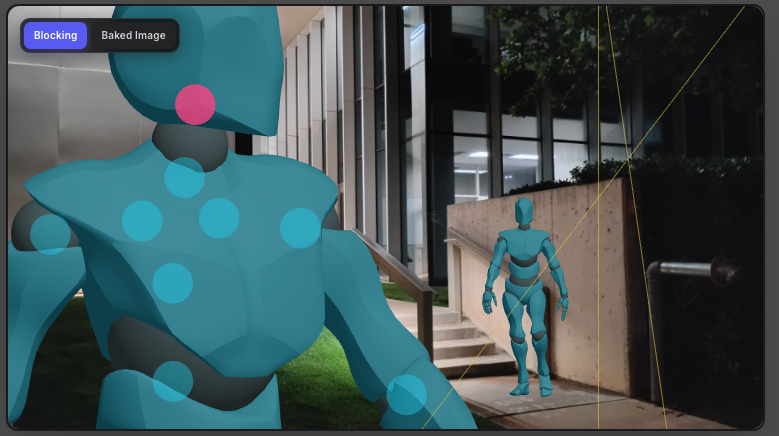
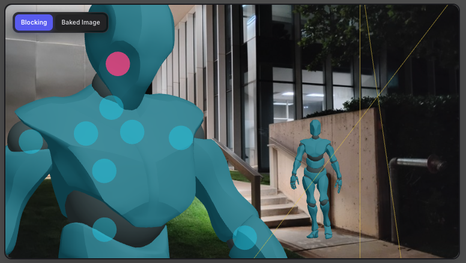
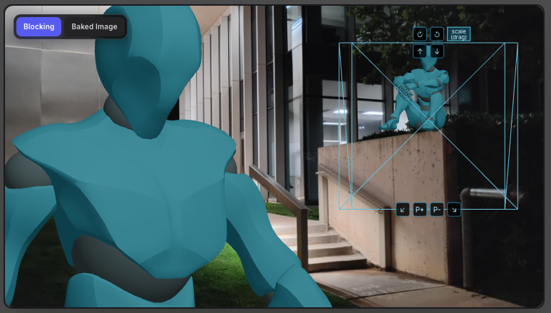
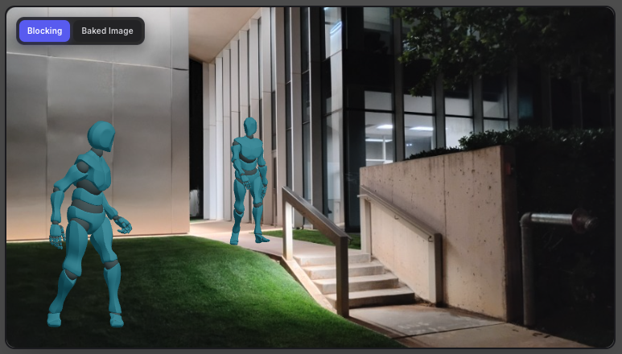

<h1>VideoGen (under development)</h1>

<h2>Introduction</h2>

<p style="width:500px">
The VideoGen project is designed to make intricate AI filmmaking moves
possible, as opposed to crafting raw 
text prompts to make videos. Take the following feature:


<p align="left" style="width:500px">
  <em>1. The user provides the backdrop plate image and sets up
   a close-up shot with two mannequins (which will be replaced later
   by the actual characters by an AI image edit model), choosing 
   poses from a provided library of model poses. </em> <br/><br/>

  
  <p style="width:500px">A solemn shot is depicted with a subject in the foreground 
  on the left (Close-up two-shot).  The user adjusted
   the head to look camera right. The user can, in a later version of the app,
  configure the facial expression and gaze direction of the characters.</p><br>
  <br>
  
</p>


<p align="left">
  <em>2. The user moves the head down of one of the mannequins.</em><br>
  <em>MORE SOMBER, LOOKING DOWN. Close-up two-shot looking down.</em><br>
  
  
</p>

<p align="left">
  <em>3. The user changes the second mannequin's to a sitting position in the
  stock library of poses and places it on the ledge.</em><br>
  <em>BLOCKING CHANGE: Subject on the ledge. (Close-up two-shot)</em><br>
  
  <br>

</p>

<p> 
Platforms like Runway and Higgsfield are built text-prompt-first.
Both optimize for "describe a shot textually, get a clip" rather than 
"place the camera, block the actors, describe the action and 
conditions second." The text-prompt-first workflow will nudge the user towards
outcomes that are common-looking for AI video. The user start on
a path that provides the AI less custom image and placement information.
Because of how today's AI works, any gaps will be filled 
in from the mean ("the dataset centroid") of AI training data.

<p>
The more that a user can provide specific information to the AI model in accordance with its
technical demands, the more that the output will reflect his or her 
own work, rather than unintentionally leaning
on the training data built into the model
that pulls in so many details.  Whenever possible, the filmmaker
should use the AI only for following a detailed 
package of images and instructions.
 
<p> 
If you can provide the AI video model exactly what you want, it will
for the most part make that. That is 
currently difficult to achieve without making use of separate
programs (that address different aspects of the AI models' quirks) 
and so AI filmmaking is either a burdensome, technical software activity or it 
involves producing uncontrolled output.  To solve this,
VideoGen plans to make a variety of conveniences. 
In short, those who are interested in handcrafting everything 
about their films rather than letting AI fill
in any details, which will make the films feel 
authentic in the end, would use VideoGen.

<p>It is worth noting that in real life filmmaking
there are two alternations occurring during production: 
the inherited resources of the situation and that which has been
procured, planned, and arranged by design, with the bigger the budget corresponding
to more that has been planned, arranged, and designed.  In other words,
on a no-budget short film the actors show up in their own clothes
(conditions given to the filmmaker), the small crew uses 
borrowed, available locations whereas in a big budget film there is 
everything from location scouts,
custom studio sets, wardrobe, set dressers and hair stylists.
The level detail rises in physical filmmaking
according to budget.  The situation is different
in AI in that it brings in big budget conditions according
to the mean of the training dataset.  That one reason AI video
leads to confusion, that it brings in big budget production quality but will
result in common-looking AI output if not fed specific resources
for video generation. What is important then is that the software assists 
the user in making many custom resources and delivering
them to the AI model.

<p>
Why text-prompt-first goes generic:
A pure text-to-video or text-to-image pipeline starts 
from the model’s "latent space". The model is trained 
on billions of images, so when you type “man in cafe,” 
it regresses to the mean: soft light, centered composition, 
shallow DOF, medium shot, vaguely European cafe.
That’s not because the model is doing too little work — it’s because 
of how this AI architecture works.  “Cafe” in the dataset is 80% that same look. The 
more abstract the prompt, the stronger the pull 
toward the dataset centroid. You get common-looking 
results because the model is doing lossy compression of culture.

 
<p>
For the posable scene, VideoGen brings in some conventions
from traditional filmmaking for setting
up shots.  Selecting CU (close-up) will
set up a mannequin facing the camera with
close-up framing.  Selecting 2S (two shot)
will add two mannequins to the CU framing.
From there the user can pose the models manually
or with a built-in library of pose animations
(walking, sitting, running, etc.), using a 
slider that capture the desired frame for
the model's pose.


<h2>Staging And Blocking</h2>

A 3D scene of mannequins posed by the user
(with a menu of available poses) is composited on top of the 
user's provided backdrop plate before
sent to an AI model for in-paint editing. 
The first use of 3D mannequins
placed in an orthographic 3D view which are swapped out
with character sheet data. 


<h2>Pose Mannequins</h2>

Being able to use 3D mannequin models to stage the first frame of an AI-generated video 
has two benefits. First it allows exact blocking of the virtual actors' positions and
gestures to set the mood and composition of the shot at a level 
on par with traditional filmmaking. 

<h3>Different Effects for The Same Frame</h3>

<p> The user will set up a shot by adding mannequins to the scene
and selecting a frame from a pose animation from the included 
database.  That is, the user will scrub through a pose animation
with a slider and choose the desired frame for the start image. 
(The database includes animations for sitting, walking,
running, reclining, etc.)

<p>In addition, the mannequins can be scaled and rotated in all three
directions. They have controls for adjustments to body parts.</p>


<p align="left">
  <em>TENSION: Looking Behind. (Long shot, two-shot)</em><br>
  
  <br>
  
</p>   


Second it accommodates the software architecture 
of these models. The generative AI video models are essentially next frame predictors
and they are not simulating physics, nor are they 
built with awareness of geometry of the training data.


VideoGen

The plan is for it to provide multiple gated workflows 
for making shots.

**1. Bake Start Frame** - Baking characters into
a pre-lit backdrop is considered the most reliable
method to produce desired results.  This is the first workflow
where users pose mannequins to block the video frame. VideoGen 
will then bake composites of your
character(s) from your character sheet(s) into the backdrop,
replacing the mannequins' orientation and location.  
In this workflow, the video model's role is only to add motion to the 
baked image based on your character sheet and prompt.

**2. Auto-place Character** - Conventional use of AI. 
Send the model your character sheet(s) + backdrop as separate items (not fused
as a single baked image), explain where you
want the character to be, and the model 
infers scale/position and places your character
into the backdrop as usual.  Optional mannequin blocking,
before submitting the mannequin scene to video model.  
This provides fast iteration. 


## Workflows and Mannequin-Based Frame Blocking

Each shot has multiple available **Workflows** in the left panel. 
Workflows define how reference images, mannequins, and camera 
settings feed into generation.

Definitions live in `video-generation-workflows.json` and 
drive the workflow dropdown, capability checks, and (for bake workflows) the shot checklist.

**Implemented today:** 
Bake Start Frame, Auto-place Character. 
Other workflows appear in the picker but are not fully wired yet.


### Mannequin frame blocking (Bake Start Frame)

The default workflow (**Bake Start Frame**) uses gray **mannequins** 
on the backdrop to block character placement before video generation. 
You position mannequins in the preview, assign character sheets to them, 
then **bake** a start frame so the video model only adds motion from your prompt.

The camera-panel **Checklist** tracks progress:

1. **Backdrop** — backdrop reference slot filled
2. **Character Sheet** — subject reference slot filled (one sheet per principal mannequin when needed)
3. **Place Mannequins** — at least one principal mannequin in the scene
4. **Assign Characters** — each principal mannequin linked to its character sheet
5. **Bake** — baked start frame ready to send as the video input

Reference slots for Character Sheet and Backdrop sit directly under 
their checklist steps. The blocking preview (Framing tab) shows mannequin 
layout only; baking composites characters into the backdrop via image edit. 
See `MANNEQUINS-BAKE-START-FRAME.md` for the two-pass bake design.

**Auto-place Character** can optionally use mannequins for blocking but 
does not bake a first frame — character sheet and backdrop go to the 
model separately and the prompt drives placement.

### Character workflows

| Workflow | Summary | When to use | Model needs |
|----------|---------|-------------|-------------|
| **Bake Start Frame** *(default)* | Mannequins block framing; bake composites character(s) into backdrop; video model adds motion only. | Eyeline, exact framing, or lighting match matters. | Image edit (`inpaint` preferred; falls back to xAI image edit). |
| **Auto-place Character** | Character sheet + backdrop sent separately; model infers scale/position. Optional mannequin blocking. No bake step before submitting to video model. | Fast iteration. | Image-to-video (Kling, Runway, Veo, Luma, etc.). |

### Environment workflows

| Workflow | Summary | When to use | Model needs |
|----------|---------|-------------|-------------|
| **Pure B-roll (no character)** | Backdrop only or text-to-video. Field Size, Lens, and Angle drive the image; prompt is atmosphere and camera move. No character sheet. | Establishing shots, landscapes, atmosphere. | Text-to-video or image-to-video. |
| **Start & End Frame** | Two baked frames; model interpolates between them. | Product reveals, logo landings — reliable opening and closing look. | First/last frame control (Kling 3.0+, Runway Gen-4, Veo 3.1). |

### Motion workflows

| Workflow | Summary | When to use | Model needs |
|----------|---------|-------------|-------------|
| **Motion Transfer / Performance** | Reference video drives character performance (Kling Motion Control, Viggle-style). Field Size and Lens are ignored — motion defines framing. | Apply motion or performance from one asset to another. | Motion transfer / pose control (Kling, Viggle, Runway Act-One). |
| **Multi-shot Sequence** | One prompt yields 3–6 connected shots (Kling 3.0). 
Subject Count and Coverage become shot-list items, not single-frame settings. | — | Kling 3.0+ native multi-shot. |

### Camera workflows

| Workflow | Summary | When to use | Model needs |
|----------|---------|-------------|-------------|
| **Camera Control** | Camera moves on a static scene or first frame — crane, dolly, pan, tilt, orbit. No character animation. | Establishing shots and product turntables where camera movement is the story. | Camera-control support (Runway Gen-4, Kling 3.0, Veo 3.1, Luma). |

### Edit workflows

| Workflow | Summary | When to use | Model needs |
|----------|---------|-------------|-------------|
| **Video Inpaint / Object Removal** | Mask objects in existing video; model fills with temporally consistent background. | Clean up footage without reshooting. | Video inpainting (Runway Aleph, Kling, Pika). |

### Utility workflows

| Workflow | Summary | Model needs |
|----------|---------|-------------|
| **Re-style / Lip-sync** | Change style or add speech on existing footage. Character sheet optional; backdrop is the video itself. | Video-to-video editing and/or lip-sync (Runway, Wan 2.7, Kling, HeyGen). |


1. Configure any supported provider with your API key
2. Set it as the default in Settings
3. Set up the shot with the VideoGen app interface.
4. Hit Generate — it routes to that provider's adapter with your key

## Film Terms in The UI

VideoGen uses some traditional filmmaking
terminology conveniences in the UI, such as shot Field Size (e.g. MCU -> 
medium close-up) and Camera Movements (tilt, pan, dolly, tracking).  

It will expand into other AI modalities in the future, such 
as image generation so that the user can generate images
in a separate use interface, save them to the media library, 
and then bring those into the video generation section.

## Service Providers And Model Categories

There are many categories of AI models that carry out different
tasks besides generating video and images. 
VideoGen has an app model type checklist so that when the user adds
providers every available model type is tracked under each
model category.

Some drive a still character with 
a reference motion or take a character image and placing
it into a provided moving image.

The eventual goal of this is to make it so that the user can
craft shots in a workflow with a variety of model types.


Describe each image in your prompt or use **@Image1** / 
**@Image2** / **@Image3** (slot-indexed; on generate they become 
`<IMAGE_1>`, `<IMAGE_2>`, etc.).


## PoseBlock (3D mannequin compositor)

VideoGen embeds **[PoseBlock](PoseBlock/)** as a git submodule 
for 3D pose blocking (replacing static PNG mannequins over time). 
Integration plan: [`PoseBlock/INTEGRATION.md`](PoseBlock/INTEGRATION.md).

```bash
# Fresh clone — include submodule
git clone --recurse-submodules https://github.com/noctivagous/videogen.git
cd videogen
npm install

# Existing clone — init submodule
git submodule update --init --recursive
npm install

# Work on PoseBlock alone
cd PoseBlock && npm install && npm run dev
```

After `npm install`, VideoGen resolves the local package via `"poseblock": "file:./PoseBlock"`. The same install step links PoseBlock's GLB models into `public/poseblock-models` (symlink when possible, copy fallback on Windows). If models 404 after cloning, run `git submodule update --init --recursive` then `npm run setup:poseblock`.

To enable the 3D compositor in the studio preview (instead of PNG mannequins), add to `.env.local`:

```bash
NEXT_PUBLIC_POSEBLOCK_COMPOSITOR=1
```

Restart `npm run dev`, open a shot on **Bake Start Frame** or **Auto-place Character**, and switch the preview to **Framing** mode.

